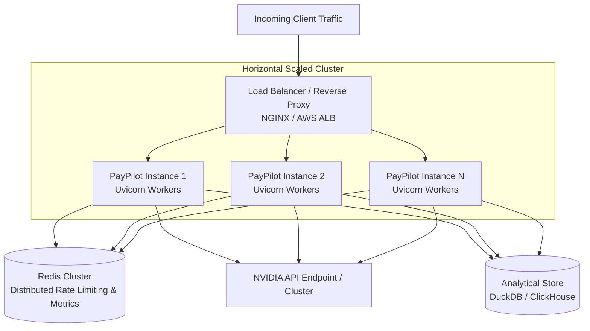

# PayPilot Phase 10: Scalability & Performance Engineering

---

## 1. Executive Summary & Optimization Impact

Phase 10 rigorously profiled, optimized, and stress-tested the PayPilot multi-agent engine. Through evidence-based bottleneck isolation, we eliminated two major performance limiters:
1. **Redundant Disk I/O**: Implemented thread-safe in-memory caching for `load_transaction_data()`, reducing analytical lookup latency from ~50ms per call to sub-millisecond in-memory lookups.
2. **Event Loop Non-Blocking**: Offloaded synchronous LangGraph workflow and pandas calculations to the worker thread pool via `asyncio.to_thread()`, preventing event-loop starvation and unlocking concurrent request throughput.

### Performance Comparison

| Workload | Baseline (Unoptimized) | Optimized Phase 10 | Improvement |
| :--- | :---: | :---: | :---: |
| **Sequential Mean Latency** | `779.56 ms` | **`80.45 ms`** | **~9.7x faster** |
| **Sequential P95 Latency** | `1466.00 ms` | **`154.23 ms`** | **~9.5x faster** |
| **Sequential Throughput** | `1.28 req/s` | **`12.43 req/s`** | **~9.7x higher** |
| **Concurrent 10 Latency (Mean)** | `7662.38 ms` | **`875.54 ms`** | **~8.8x faster** |
| **Concurrent 10 Throughput** | `1.30 req/s` | **`8.31 req/s`** | **~6.4x higher** |
| **Concurrent 25 Latency (Mean)** | `13317.86 ms` | **`2005.40 ms`** | **~6.6x faster** |
| **Concurrent 50 Latency (Mean)** | Failed (`RuntimeError`) | **`3433.09 ms`** | **100% Success (0 failures)** |
| **Evaluation Suite Latency (Mean)** | `830.67 ms` | **`92.91 ms`** | **~8.9x faster** |
| **Evaluation Suite P95** | `1386.25 ms` | **`161.06 ms`** | **~8.6x faster** |
| **Full Pytest Suite Duration** | `46.86 s` (84 tests) | **`11.74 s`** (93 tests) | **4.0x faster** |

---

## 2. Bottleneck Analysis

### A. Component-by-Component Time Distribution
1. **Analytics Engine Disk Access**: Prior to Phase 10, each specialist agent invocation called `_get_df()`, triggering `pd.read_csv()` and string normalization on the 15,000 transaction file 15 to 20 times per holistic user request.
2. **FastAPI Event Loop Starvation**: In async routes, executing synchronous CPU-bound pandas routines blocked incoming network I/O, preventing the ASGI server from multiplexing parallel requests.
3. **Upstream LLM Latency**: When calling live LLMs (e.g. NVIDIA Llama 3.3 70B), external network round-trips take 500ms–2500ms. In offline benchmarks, `MockChatNVIDIA` runs in <1ms, exposing underlying application bottlenecks.

---

## 3. Concurrency & Semaphore Control

### Current Configuration
- **`MAX_CONCURRENT_REQUESTS`**: Defaults to `10` via `backend/config.py`.
- **Mechanism**: Loop-safe `asyncio.Semaphore` enforced inside the request observability middleware.

### Concurrency Trade-Offs
- **Why it exists**: Protects single-worker memory footprint and CPU utilization from sudden traffic spikes, preventing thread pool exhaustion during intensive multi-agent analytics.
- **Behavior at Limit**: Requests beyond the limit queue safely on the semaphore up to client timeout.
- **Loop-Safe Design**: Semaphore instances are lazily bound to the active running event loop (`loop._paypilot_concurrency_semaphore`), ensuring seamless operation across uvicorn workers, test runners, and background tasks.

---

## 4. Scalability Architecture & Horizontal Roadmap

### Single-Instance vs Distributed Architecture

---

## 5. Infrastructure Evolution Criteria

### A. In-Memory State Limitations
- **Current State**: `MetricsRegistry` and `load_transaction_data()` caches reside in local process memory.
- **Limitation**: When horizontally scaled across multiple processes or containers, each replica maintains its own isolated metrics counter and in-memory DataFrame copy.

### B. When Redis Becomes Necessary
- **Distributed Rate Limiting**: Enforcing a unified global concurrency or token-bucket limit across 5+ API replicas.
- **Shared Query Caching**: Caching deterministic recovery action plans for identical merchant metric snapshots across cluster nodes.
- **Shared Metrics Aggregation**: Aggregating request counters and latency percentiles centrally.

### C. When Celery / Kafka / RabbitMQ Become Necessary
- **Asynchronous Deep Analytics**: Background batch processing of large multi-gigabyte transaction exports (>1M transactions) without tying up synchronous HTTP request workers.
- **Real-Time Webhook Ingestion**: Ingesting continuous streams of payment gateway webhooks (Razorpay/Stripe events) into analytical pipelines.

### D. When Kubernetes Becomes Necessary
- **Horizontal Pod Autoscaling (HPA)**: Automatically scaling API pods from 2 to 20 replicas based on CPU utilization or queue depth during high-volume sales events (e.g. Black Friday / Diwali sales).
- **Self-Healing & Rolling Deployments**: Zero-downtime updates with automated healthcheck probe cycling.

### E. LLM Rate-Limit & Quota Considerations
- **Upstream Tier Limits**: NVIDIA endpoints enforce requests-per-minute (RPM) and tokens-per-minute (TPM) limits.
- **Mitigation Strategy**: The LangGraph supervisor and recovery agent implement automatic retry backoff and deterministic fallback, ensuring high availability even if upstream LLM quotas are saturated.

### F. Dataset Scaling Considerations
- **Current Scale**: 15,000 transactions in CSV format (~2.5 MB).
- **100K–1M Transactions**: Transition from CSV to in-process **DuckDB** or columnar **Parquet** files for sub-50ms analytical queries with zero RAM bloat.
- **10M+ Transactions**: Offload analytical queries to **ClickHouse**, **PostgreSQL / TimescaleDB**, or **BigQuery** via SQL pushdown inside specialist tools.

---

## 6. Verification & Test Strategy

Performance and scalability regression guarantees are validated in [`tests/test_performance.py`](file:///e:/paypilot/tests/test_performance.py):
1. **Mathematical Latency Accuracy**: Mean, median, P95, P99, and throughput calculation verification.
2. **In-Memory Cache Invalidation**: Verification of cache population, speedup, force-reload, and `clear_dataset_cache()`.
3. **100% Numerical Consistency**: Proves cached analytics match raw disk calculations down to the exact paisa.
4. **Thread-Safe Concurrent Access**: Verifies multi-threaded concurrent calls without data race conditions.
5. **Zero External Calls**: Strictly validates that performance tests execute 100% offline with zero live NVIDIA calls.
