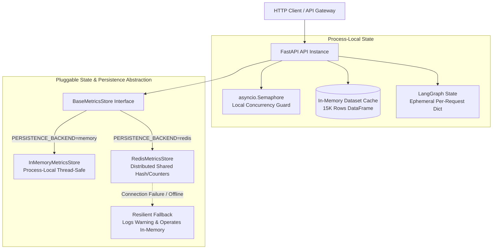
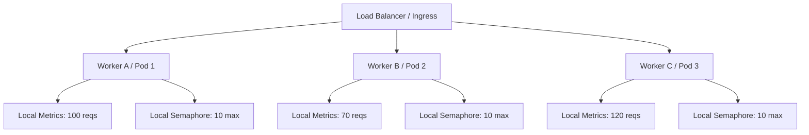

# PayPilot Phase 11: Distributed State & Persistence Architecture

---

## 1. Executive Summary

Phase 11 audits all state in the PayPilot Multi-Agent Engine, establishes a clear taxonomy between process-local and distributed state, introduces a pluggable `BaseMetricsStore` abstraction (`InMemoryMetricsStore` default with optional `RedisMetricsStore` and resilient in-memory fallback), and evaluates persistent database and caching strategies for horizontal scaling.



---

## 2. Current State Audit & Classification

| State Component | Implementation Location | Nature | Shared Across Workers? | Survives Process Restart? | Safe to Keep Process-Local? | Technical Rationale |
| :--- | :--- | :---: | :---: | :---: | :---: | :--- |
| **`MetricsRegistry`** | [`backend/observability/store.py`](file:///e:/paypilot/backend/observability/store.py) | Mutable In-Memory | No (in single-node) | No | Yes (Single-Node) | Aggregates request counts, agent timings, and errors in memory (<1 ms latency). |
| **`concurrency_semaphore`** | [`backend/api/main.py`](file:///e:/paypilot/backend/api/main.py) | Event-Loop Bound | No | No | Yes (Per-Worker) | Protects process CPU and thread pool from overload; total cluster concurrency = `N_workers * MAX_CONCURRENT_REQUESTS`. |
| **`dataset_cache` (`_CACHED_DF`)** | [`backend/tools/analytics.py`](file:///e:/paypilot/backend/tools/analytics.py) | Immutable Reference Data | No (Per-Process) | No (Reloaded on start) | Yes | 15,000 transaction DataFrame (3.2 MB RAM) is read-only reference data; local caching avoids inter-process network hops. |
| **`LangGraph State` (`PayPilotState`)** | In-flight execution dict | Ephemeral Per-Request | No | No | Yes | Stateless HTTP request-response flow; state lives and dies within a single asynchronous request execution. |
| **`Configuration`** | [`backend/config.py`](file:///e:/paypilot/backend/config.py) | Immutable Env / Constants | No | No | Yes | Read from environment at process initialization. |

---

## 3. Distributed Scaling Analysis: 1 Process vs Multi-Worker vs Multi-Instance

### Multi-Instance State Divergence Scenario
When PayPilot scales horizontally across 3 worker processes or container replicas:



1. **Metrics Divergence**:
   - `Worker A` processes 100 requests.
   - `Worker B` processes 70 requests.
   - `Worker C` processes 120 requests.
   - A client querying `GET /metrics` receives the telemetry of whichever worker the load balancer targets (e.g. `total=70`), rather than the cluster total (`290`).
2. **Concurrency Limit Multiplier**:
   - `MAX_CONCURRENT_REQUESTS=10` is enforced per process.
   - Across 3 instances, effective cluster concurrency capacity is `30 requests`.

---

## 4. Redis Decision: Current Architecture vs Future Scaling

### Decision: Pluggable Abstraction with In-Memory Default
- **Why Redis is NOT mandatory today**:
  - PayPilot is an analytical decision engine serving read-only merchant diagnostic queries.
  - Adding a mandatory Redis dependency introduces an external point of failure and operational complexity without performance gain for single-node / containerized deployments.
- **Pluggable Architecture Implemented**:
  - We introduced `BaseMetricsStore` with `InMemoryMetricsStore` as the default.
  - An optional `RedisMetricsStore` is provided for multi-replica setups via `PERSISTENCE_BACKEND=redis` and `REDIS_URL`.
  - **Zero-Crash Resilience**: If Redis is unreachable, `RedisMetricsStore` logs a categorized warning and falls back to local in-memory operation without crashing the API.

---

## 5. Database & Persistence Decision

### Decision: Static Reference File Today, Analytical Warehouse Tomorrow
- **Current Dataset**: 15,000 synthetic transactions in CSV format (~2.5 MB).
- **Why an OLTP Database (Postgres/MySQL) is NOT required today**:
  - Transactions are static reference data loaded once at startup.
  - In-memory pandas vectorization computes aggregations across 15,000 rows in `< 0.1 ms`—faster than any database network round-trip.
- **Future Migration Path**:
  1. **Medium Scale (100K–1M rows)**: In-process **DuckDB** or **Parquet** format.
  2. **High Scale (10M+ live transactions)**: **ClickHouse** / **PostgreSQL (TimescaleDB)** with SQL pushdown inside specialist agent tools.

---

## 6. Distributed Concurrency & Rate Limiting Strategy

| Level | Mechanism | Scope | Production Recommendation |
| :--- | :--- | :--- | :--- |
| **Worker-Level (Current)** | `asyncio.Semaphore` | Process-Local | Prevents event loop starvation and thread pool exhaustion within a single worker. |
| **Cluster-Level (Future)** | Redis Token Bucket / Leaky Bucket | Global Fleet | Enforces global merchant tier limits and protects upstream LLM quotas (e.g. 50 RPM to NVIDIA). |
| **Ingress-Level (Future)** | NGINX / Cloudflare Rate Limiter | Network Edge | Mitigates DDoS attacks and brute-force traffic spikes before hitting application workers. |

---

## 7. Failure Behavior & Graceful Degradation Matrix

```text
Configured Backend: REDIS
Redis Status       : UNREACHABLE / CONNECTION TIMEOUT
Action             : Log categorized warning ("Redis connection failed, falling back to in-memory store")
Degradation Mode   : Set backend_type = "redis_fallback_memory"
System Impact      : ZERO downtime; API requests and /metrics continue operating cleanly in-memory
Distributed State  : Temporarily process-local until Redis connection recovers
```

---

## 8. Current Implementation vs Future Production Scaling

### Current Implementation (Phase 11)
- **Persistence Backend**: In-Memory (`PERSISTENCE_BACKEND=memory`).
- **Store Abstraction**: `BaseMetricsStore` -> `InMemoryMetricsStore` & `RedisMetricsStore`.
- **Dataset Storage**: `data/processed/merchant_transactions.csv` (cached in-memory).
- **Concurrency**: Process-local `asyncio.Semaphore(10)` bound to active event loops.
- **Test Suite**: 100% offline, zero Redis/external requirements.

### Future Production Scaling (Phase 12+)
- **Shared Telemetry**: `PERSISTENCE_BACKEND=redis` or OpenTelemetry Collector exporting to Prometheus/Grafana.
- **Distributed Rate Limiting**: Redis-backed global token bucket for NVIDIA API rate limits.
- **Persistent Analytics Store**: DuckDB / ClickHouse for multi-million row merchant transaction history.
- **Asynchronous Task Queue**: Celery / Redis Streams for long-running multi-year diagnostic audits.
