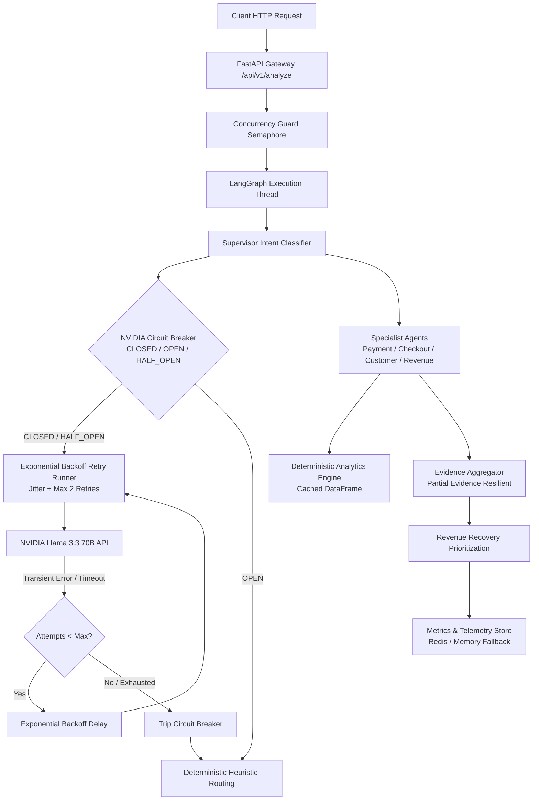

# PayPilot Phase 12: Reliability, Resilience & Failure Recovery

---

## 1. Executive Summary & Resilience Goals
Phase 12 hardens PayPilot against transient infrastructure faults, upstream LLM provider outages, partial specialist agent exceptions, and database degradation. The system is engineered to fail predictably, safely, and transparently—never fabricating data, never exposing credentials or internal stack traces, and always preserving deterministic analytical truth.



---

## 2. Failure Point Audit

| Component | Failure Mode | Failure Type | Current Fallback / Mitigation | Retry Appropriate? |
| :--- | :--- | :--- | :--- | :--- |
| **FastAPI Request Handling** | Empty, whitespace, oversized (>1000 chars), or malformed JSON | `validation_error` | HTTP 400 / 422 with sanitized JSON message | **No** (Deterministic client error) |
| **Concurrency Guard** | Requests exceeding `MAX_CONCURRENT_REQUESTS` (10) | `concurrency_limit` | Async semaphore queuing; protects against OOM | **No** (Handled via asyncio queue) |
| **Supervisor LLM** | NVIDIA timeout, HTTP 429/503, connection drop | `timeout` / `provider_error` | Exponential backoff retry -> Deterministic keyword heuristic | **Yes** (Transient network/capacity errors) |
| **Supervisor Routing** | Ambiguous prompt producing unparseable response | `routing_error` | Deterministic keyword routing regex fallback | **No** (Retry won't fix structural misunderstanding) |
| **Analytics Engine** | Missing column, empty dataset, corrupted file | `analytics_error` | Exception logged, safe empty metrics dictionary returned | **No** (Deterministic data issue; never invent numbers) |
| **Dataset Loading** | File I/O lock, disk latency | `analytics_error` | Thread-safe in-memory cache (`_CACHED_DF`) prevents I/O | **No** (Memory cached) |
| **Specialist Agents** | Missing subfield or single-agent computation error | `agent_failure` | Failed agent recorded in metrics; partial evidence captured | **No** (Deterministic logic issue) |
| **Evidence Aggregator** | Incomplete specialist evidence | `partial_evidence` | Formats available facts, flags missing sections, no fabricated data | **No** (Degrades gracefully) |
| **Executive Synthesis LLM** | NVIDIA timeout or upstream outage | `timeout` / `provider_error` | Exponential backoff retry -> Deterministic executive report | **Yes** (Transient LLM failure) |
| **Recovery Prioritization** | Missing evidence dictionary | `analytics_error` | Evaluates remaining facts, produces bounded ranked actions | **No** (Deterministic multi-factor formula) |
| **Persistence (Redis)** | Redis down, connection timeout, DNS resolution error | `persistence_error` | Logs categorized warning; seamlessly routes to `InMemoryMetricsStore` | **No** (Degrades to local memory) |
| **Observability Telemetry** | Metric update during race condition | `internal_error` | Reentrant `threading.Lock` protects counters | **No** (Thread-safe) |

---

## 3. Retry Strategy & Exponential Backoff

### Error Classification
PayPilot strictly segregates transient network anomalies from permanent programmatic or business failures:

- **Transient (Retryable)**:
  - `TimeoutError`, `ReadTimeout`, `ConnectTimeout`
  - `ConnectionResetError`, `APIConnectionError`, `RemoteDisconnected`
  - HTTP `429` (Rate Limited), `500`, `502`, `503` (Service Unavailable), `504` (Gateway Timeout)
- **Permanent (Non-Retryable)**:
  - `ValueError`, `KeyError`, `TypeError`, `IndexError`, `AssertionError`
  - HTTP `400` (Bad Request), `401`/`403` (Authentication/Authorization)
  - Deterministic analytics calculation errors

### Backoff & Jitter Formulation
The retry runner implements bounded binary exponential backoff with random jitter:

$$\text{Delay}_k = \min\left(\text{BaseDelay} \times 2^{k-1},\; \text{MaxDelay}\right) \times \text{Uniform}(0.8, 1.2)$$

- **Default Configuration**:
  - `LLM_MAX_RETRIES`: `2`
  - `LLM_RETRY_BASE_DELAY`: `0.5s`
  - `LLM_RETRY_MAX_DELAY`: `4.0s`
  - `LLM_REQUEST_TIMEOUT`: `25.0s`

*Why Jitter?* Jitter desynchronizes concurrent retrying requests during sudden upstream throttling spikes, preventing the "thundering herd" effect on NVIDIA endpoints.

---

## 4. Upstream Circuit Breaker Design

A thread-safe 3-state Circuit Breaker (`backend/utils/resilience.py`) protects upstream NVIDIA provider bandwidth:

```
      +---------+    3 Consecutive Failures     +--------+
      |         | ----------------------------> |        |
      | CLOSED  |                               |  OPEN  |
      |         | <---------------------------- |        |
      +---------+      Probe Call Succeeds      +--------+
           ^                                         |
           |                                         | Cooldown (30s)
           |             +-------------+             | Expired
           +------------ |  HALF_OPEN  | <-----------+
                         +-------------+
```

1. **CLOSED**: Normal state. All requests proceed to execute with retry.
2. **OPEN**: Tripped after 3 consecutive transient failures or timeouts. In this state, LLM invocations are immediately bypassed directly to deterministic fallbacks (0ms network wait).
3. **HALF_OPEN**: After a 30-second recovery cooldown, a single probe request is permitted. If it succeeds, the circuit transitions back to `CLOSED`. If it fails, it trips immediately back to `OPEN`.

---

## 5. Agent & Analytics Failure Degradation

### Partial Evidence Handling
If a specialist agent fails during a holistic inquiry (e.g. `checkout_agent` fails due to an unexpected format while `revenue_agent` and `payment_agent` succeed):
- PayPilot **never aborts the entire diagnostic**.
- The Evidence Aggregator synthesizes the available verified facts.
- Missing sections are explicitly noted rather than fabricated.
- Prioritization formulas operate on observed facts without hallucinating unobserved losses.

### Numerical Source-of-Truth Protection
- LLMs are strictly prohibited from generating raw financial numbers.
- If the Analytics Engine encounters an unrecoverable failure, PayPilot returns a categorized `analytics_error` rather than allowing an LLM to invent synthetic transaction metrics.

---

## 6. Persistence Resilience (Redis -> In-Memory)
- If `PERSISTENCE_BACKEND="redis"` is set but Redis is unreachable:
  - PayPilot logs a categorized `persistence_error` warning.
  - Telemetry seamlessly records into the local `InMemoryMetricsStore`.
  - The API health and analyze routes continue operating without throwing 500 exceptions.
  - `/metrics` snapshot reports `"backend": "redis_fallback_memory"`, honestly declaring degraded local operation.

---

## 7. Idempotency Analysis

The `/api/v1/analyze` endpoint is **inherently read-only and idempotent**:
- Processing a query executes analytic queries across historical transaction tables without modifying records or persisting merchant state mutations.
- Duplicate identical requests produce identical analytical evaluations and recovery recommendations.
- Because no state-altering transactions are created, distributed idempotency locks (e.g. idempotency keys with distributed leases) are intentionally omitted to avoid unnecessary architectural overhead.

---

## 8. Error Taxonomy Reference

| Error Category | Description | HTTP Code | Fallback Behavior |
| :--- | :--- | :--- | :--- |
| `validation_error` | Query empty, whitespace, or exceeds 1000 characters | 400 | Return structured JSON error |
| `timeout` | Upstream NVIDIA LLM request exceeded 25.0s | 200 (Degraded) | Deterministic fallback synthesis |
| `provider_error` | NVIDIA API returned 5xx or connection was severed | 200 (Degraded) | Retry -> Circuit breaker -> Fallback |
| `routing_error` | LLM produced unparseable JSON router output | 200 (Degraded) | Keyword-based regex routing |
| `analytics_error` | Anomaly in dataset calculation or empty data | 500 / Logged | Return safe analytical error notice |
| `persistence_error` | Redis connection dropped or timed out | Logged | In-memory store fallback |
| `internal_error` | Unexpected runtime exception | 500 | Sanitized error response, zero stack trace |
