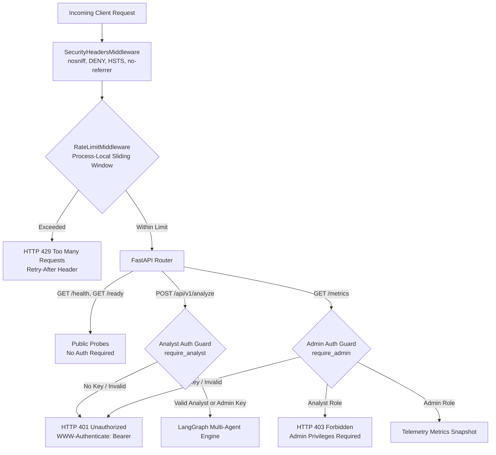

# PayPilot Phase 13: API Security, Authentication & Authorization

---

## 1. Executive Summary & Security Goals
Phase 13 introduces a production-ready, testable, and robust security layer for PayPilot's FastAPI backend. The security architecture is designed specifically for high-throughput enterprise payment intelligence platforms:
- **Zero-Friction Integration**: Dual-header authentication (`X-API-Key` and `Authorization: Bearer <key>`) provides standard support for both SDK clients and API gateway proxies.
- **Timing-Attack Resilience**: Cryptographic verification utilizes `secrets.compare_digest` in constant time.
- **Minimalist Role-Based Access Control (RBAC)**: Two explicit roles (`analyst` and `admin`) cleanly separate merchant analytics workflows from operational telemetry.
- **Probe Availability**: Health and readiness endpoints (`/health`, `/ready`) remain publicly accessible to ensure seamless container orchestration and load balancing without token rotation friction in probe definitions.
- **Volumetric Abuse Protection**: A process-local sliding-window rate limiter prevents endpoint denial-of-service attempts with standard `Retry-After` retry headers.
- **Zero Secret Leakage**: Response schemas, error payloads, telemetry metrics, and structured log streams strictly omit tokens, keys, and internal tracebacks.



---

## 2. Comprehensive Security Audit

| Component / Vector | Surface | Classification | Threat / Risk | Implemented Mitigation |
| :--- | :--- | :--- | :--- | :--- |
| **Analysis Endpoint** | `POST /api/v1/analyze` | Protected | Unauthorized query execution, compute exhaustion | Requires `analyst` or `admin` API key; query length validation (`MAX_QUERY_LENGTH=1000`); async concurrency guard |
| **Metrics Telemetry** | `GET /metrics` | Protected | Operational reconnaissance, error rate probing | Requires `admin` API key (HTTP 403 for analyst); secret patterns stripped from all metric keys |
| **Liveness Probe** | `GET /health` | Public | Status polling | Returns high-level service status; zero credentials or internal stack traces exposed |
| **Readiness Probe** | `GET /ready` | Public | Infrastructure health check | Checks dataset presence and analytics readiness; safe boolean diagnostic flags |
| **Credential Comparison** | Auth Verification | Internal | Side-channel timing attack | Constant-time evaluation via `secrets.compare_digest(token, key)` |
| **HTTP Response Headers** | All Endpoints | Gateway | Clickjacking, MIME-sniffing, downstream caching | `X-Content-Type-Options: nosniff`, `X-Frame-Options: DENY`, `HSTS`, `Cache-Control: no-store` |
| **Volumetric Traffic** | All Endpoints | Gateway | DoS, upstream quota depletion | Sliding-window rate limiter per client IP with dynamic retry window (`HTTP 429`) |
| **Structured Logging** | App Middleware | Internal | Secret leakage into log collectors | Structured logging records `request_id`, path, method, status code, latency, error category; auth headers stripped |
| **Error Handling** | Exception Handlers | Gateway | Internal path disclosure, provider tracebacks | Standardized `ErrorResponse` schema with generalized client error messages |

---

## 3. Authentication Design

### Strategy Comparison & Justification

| Strategy | Suitability for PayPilot | Trade-offs & Decision |
| :--- | :--- | :--- |
| **API Key / Bearer Token** | **High (Selected)** | Standard for payment infrastructure (Stripe, Razorpay, OpenAI). Lightweight, stateless, zero-latency verification, timing-safe. |
| **JSON Web Tokens (JWT)** | Moderate | Introduces asymmetric key management, expiry claims, and token refreshing overhead without distributed auth servers. |
| **OAuth2 / OIDC** | Low | Requires external identity provider (IdP), token exchange redirects, and increased network latency for backend microservice calls. |

### Dual Header Credential Extraction
PayPilot accepts credentials interchangeably via:
1. `X-API-Key: <api_key>` (standard custom API key header)
2. `Authorization: Bearer <api_key>` (standard OAuth2/Bearer authorization header)

Malformed authorization formats (e.g., `Basic ...` or empty tokens) are rejected immediately with HTTP 401 and an explicit `WWW-Authenticate: Bearer` challenge header.

```python
def _extract_credentials(
    x_api_key: Optional[str] = None,
    authorization: Optional[str] = None,
) -> Optional[str]:
    if x_api_key and x_api_key.strip():
        return x_api_key.strip()
    if authorization and authorization.strip():
        auth_header = authorization.strip()
        parts = auth_header.split()
        if len(parts) == 2 and parts[0].lower() == "bearer":
            return parts[1].strip()
        return None
    return None
```

---

## 4. Authorization & Role Model

PayPilot enforces a lean, two-tier Role-Based Access Control (RBAC) model:

```
                      +-------------------+
                      |   Admin Role      |
                      | (PAYPILOT_ADMIN)  |
                      +---------+---------+
                                |
                   +------------+------------+
                   |                         |
                   v                         v
        +--------------------+    +--------------------+
        |  POST /api/analyze |    |    GET /metrics    |
        +--------------------+    +--------------------+
                   ^
                   |
        +----------+---------+
        |   Analyst Role     |
        | (PAYPILOT_API_KEY) |
        +--------------------+
```

### Role Matrix

| Role | Permitted Endpoints | Description | Unauthorized Response |
| :--- | :--- | :--- | :--- |
| **Unauthenticated** | `/health`, `/ready`, `/docs`, `/openapi.json` | System monitors, orchestrators, container probes | `401 Unauthorized` on protected routes |
| **Analyst** | `/api/v1/analyze`, `/health`, `/ready` | Merchant operators, business analysts, automated pipelines | `403 Forbidden` on `/metrics` |
| **Admin** | All endpoints including `/metrics` | System administrators, DevOps telemetry collectors | Full Access |

---

## 5. Public vs. Protected Endpoints

### Public Endpoints
- `GET /health`: Fast liveness probe returning operational status and active model tag.
- `GET /ready`: Readiness probe verifying dataset existence and analytics engine initialization.
- `GET /docs`, `GET /redoc`, `GET /openapi.json`: OpenAPI contract documentation.

*Why Keep Probes Public?*
Container orchestrators (Docker, Kubernetes, AWS ECS, Google Cloud Run) execute health checks periodically (e.g., every 5–15 seconds). Enforcing authentication on probe endpoints creates operational failure modes during credential rotation and requires embedding secrets in orchestrator pod/task definitions. Probes expose zero sensitive business evidence.

### Protected Endpoints
- `POST /api/v1/analyze`: Requires `analyst` or `admin`. Executes the full LangGraph multi-agent pipeline.
- `GET /metrics`: Requires `admin`. Exposes aggregated system telemetry, agent latencies, error categories, and request volumes.

---

## 6. Process-Local Sliding-Window Rate Limiting

### Design & Behavior
The rate limiter (`InMemoryRateLimiter`) tracks client request timestamps in a thread-safe sliding window:
- **Default Limit**: `60 requests` per `60 seconds` per client IP.
- **Sliding Window**: Request timestamps are stored in `collections.deque` and evicted as `now - timestamp > window_seconds`.
- **429 Response**: Returns a structured JSON payload with a `Retry-After: <seconds>` HTTP header indicating the remaining cooldown period.

```
Request Stream:  [t-55s]  [t-30s]  [t-10s]  [t-2s]  --> [NOW]
Window:          |------------------ 60s -------------------|
Count in Window: 5 requests <= Limit (60) --> Allowed (200 OK)
```

> [!NOTE]
> **Process-Local Architecture**:
> This rate limiter operates locally within each worker process. In multi-worker or multi-container deployments without Redis rate limiting, each worker maintains an independent sliding window. For global distributed rate limiting, Redis token bucket rate limiting can be enabled.

---

## 7. Security Headers & Hardening Middleware

The `SecurityHeadersMiddleware` automatically injects the following security headers into every outgoing HTTP response:

| Header | Configured Value | Purpose |
| :--- | :--- | :--- |
| `X-Content-Type-Options` | `nosniff` | Prevents browser MIME-type sniffing attacks. |
| `X-Frame-Options` | `DENY` | Prevents clickjacking by prohibiting iframe rendering. |
| `Strict-Transport-Security` | `max-age=31536000; includeSubDomains` | Enforces HTTPS connections downstream. |
| `Referrer-Policy` | `no-referrer` | Prevents credential or URL path leakage in referrer headers. |
| `Permissions-Policy` | `geolocation=(), microphone=(), camera=()` | Disables unnecessary browser capabilities. |
| `Cache-Control` | `no-store, no-cache, must-revalidate` | Prevents proxy/browser caching of dynamic `/api/` and `/metrics` responses. |

---

## 8. Error Responses & Logging Security

### Error Response Schema
All authentication, authorization, and validation failures return standardized, clean JSON responses:

```json
{
  "error": "HTTP_401",
  "detail": "Authentication required. Provide a valid API key via X-API-Key or Authorization: Bearer header.",
  "request_id": "9f7b1e4c-1234-4a5b-8c9d-abcdef012345",
  "status_code": 401,
  "timestamp": "2026-08-24T12:00:00.000000+00:00"
}
```

### Logging Sanitization
- Request logging middleware logs `--> [request_id] METHOD /path` and `<-- [request_id] STATUS in Xms`.
- Raw `Authorization` headers, `X-API-Key` headers, and token strings are **never** logged.
- Failed authentication attempts record structured operational metrics under the `"auth_error"` and `"forbidden_error"` error categories.

---

## 9. Verification & Test Results

### 1. Pytest Test Suite
- Total Tests: **125 passed** (113 existing regression tests + 12 new Phase 13 security tests)
- Duration: **18.83s**
- Coverage: Authentication rejection (401), Bearer & X-API-Key authorization (200), Invalid credentials (401), RBAC metrics access (403/200), Public probes (200), Security headers, Malformed headers, Sliding-window rate limiting (429), Secret omission.

### 2. Multi-Agent Benchmark Evaluation
- Total Cases: **32/32 Passed (100.0%)**
- Mode: `OFFLINE / MockChatNVIDIA` (Zero external network calls)
- Average Latency: **100.49ms**
- Numerical & Recommendation Correctness: **100.0%**

### 3. Concurrency & Performance Benchmark
- Total Requests: **101 requests**
- Failures: **0 (0.0% failure rate)**
- Sequential 10 Throughput: **10.30 req/s** (Mean: 97.08ms)
- Concurrent 50 Stress Test: **7.45 req/s** (Throughput with 50 simultaneous workers)
