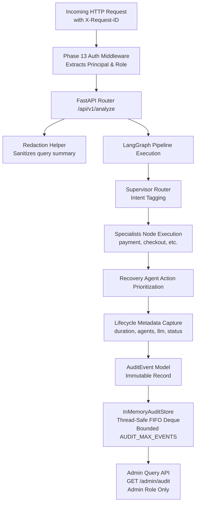

# PayPilot Phase 14: Audit Logging, Traceability & Compliance

---

## 1. Executive Summary & Audit Goals
Phase 14 delivers a production-grade, compliance-ready audit logging and traceability system for PayPilot. In modern enterprise payment environments, operational transparency is paramount: systems must be able to answer who initiated an action, what pipeline stages were invoked, what decisions were reached, how long each stage took, and what failures or retries occurred—all while strictly safeguarding private merchant data, API keys, and authorization credentials.



---

## 2. Audit Event Schema

Every auditable interaction in PayPilot produces a strongly-typed `AuditEvent` record with the following schema:

| Field Name | Type | Description | Sanitization / Compliance Rule |
| :--- | :--- | :--- | :--- |
| `event_id` | `str` | Unique audit event identifier (e.g. `aud_9f7b1e4c1234`) | Generated via high-entropy UUID |
| `timestamp` | `str` | UTC ISO-8601 timestamp (`YYYY-MM-DDTHH:MM:SS.ffffff+00:00`) | Standard UTC timestamp |
| `event_type` | `str` | Categorical lifecycle event (`request_completed`, `request_failed`, `auth_failure`, `rate_limit_exceeded`) | Stable categorical string |
| `request_id` | `str` | Correlation tracking ID matching `X-Request-ID` | Preserves incoming or generates UUID |
| `endpoint` | `str` | Target API path (e.g. `/api/v1/analyze`, `/metrics`, `/admin/audit`) | Normalized route path |
| `http_method` | `str` | HTTP request method (`POST`, `GET`, etc.) | Uppercase standard method |
| `client_id` | `str` | Safe principal identifier (`merchant-client`, `admin-client`, `anonymous-dev`) | **Never** raw API key or token |
| `role` | `str` | Authenticated access role (`analyst`, `admin`, `anonymous`) | RBAC role designation |
| `intent` | `Optional[str]` | Classified business intent (`revenue`, `payment`, `checkout`, `customer`, `what_if`) | From supervisor state |
| `executed_agents` | `List[str]` | Actual list of specialist agents dispatched | Recorded directly from state |
| `status` | `str` | Outcome status (`success`, `failed`, `rejected`) | Canonical status string |
| `status_code` | `int` | Final HTTP status code returned (200, 400, 401, 403, 422, 429, 500) | Standard integer status |
| `duration_ms` | `float` | Measured end-to-end execution latency in milliseconds | High-resolution timer (`time.perf_counter`) |
| `llm_provider` | `Optional[str]` | Active LLM inference provider (`nvidia`, `deterministic_fallback`, `mock`) | Safe provider tag |
| `model` | `Optional[str]` | Active model identifier (`meta/llama-3.3-70b-instruct`) | Safe model string |
| `retry_count` | `int` | Number of upstream LLM retries attempted | Upstream resilience counter |
| `fallback_used` | `bool` | Flag indicating whether deterministic fallback was triggered | Boolean indicator |
| `error_category` | `Optional[str]` | Normalized error taxonomy category | Non-sensitive category |
| `query_summary` | `Optional[str]` | Truncated, redacted query summary for debugging | Bounded to 80 chars; all secret patterns stripped |

---

## 3. Storage Abstraction & Bounded Retention

### `BaseAuditStore` Interface
An extensible abstract interface defines standard operations for audit stores:
```python
class BaseAuditStore(abc.ABC):
    @abc.abstractmethod
    def record_event(self, event: AuditEvent) -> None: ...
    @abc.abstractmethod
    def get_events(self, limit: int = 100, offset: int = 0, event_type: Optional[str] = None, request_id: Optional[str] = None) -> List[AuditEvent]: ...
    @abc.abstractmethod
    def get_event_by_id(self, event_id: str) -> Optional[AuditEvent]: ...
    @abc.abstractmethod
    def count(self) -> int: ...
    @abc.abstractmethod
    def reset(self) -> None: ...
```

### `InMemoryAuditStore` (Default Implementation)
- **Ring Buffer**: Implemented using `collections.deque(maxlen=AUDIT_MAX_EVENTS)` protected by a reentrant `threading.Lock`.
- **FIFO Eviction**: When the store reaches `AUDIT_MAX_EVENTS` (default: 1,000 events), the oldest records are automatically dropped from memory as new events arrive.
- **Query & Filter**: Supports chronological reversal (newest first), exact `request_id` lookup, `event_type` filtering, and pagination (`limit`, `offset`).

---

## 4. Reusable Redaction Engine (`backend/utils/redaction.py`)

PayPilot incorporates automated defense-in-depth sanitization to prevent sensitive credential reflection:

1. **Text Scrubbing (`redact_sensitive_text`)**:
   - Matches and masks NVIDIA API keys (`nvapi-...` -> `[REDACTED_SECRET]`)
   - Matches generic keys (`sk-...`, `paypilot-...` -> `[REDACTED_SECRET]`)
   - Matches bearer and basic tokens (`Bearer ...` -> `Bearer [REDACTED_TOKEN]`)
   - Matches inline key-value pairs (`api_key: ...`, `password: ...` -> `[REDACTED_SECRET]`)
2. **Dictionary Scrubbing (`redact_sensitive_dict`)**:
   - Recursively walks complex structures and scrubs keys matching `api_key`, `authorization`, `bearer`, `token`, `password`, `secret`, `nvidia_api_key`.
3. **Query Summarization (`summarize_query_safely`)**:
   - Normalizes whitespace, runs full text redaction, and bounds length to 80 characters with a clean `... [truncated]` indicator.

---

## 5. Request Correlation & Observability Integration

### Correlation Pipeline
```
Client Request
  ├── X-Request-ID: req-abc-123 (Preserved or UUID generated)
  │
  ├── Processed via FastAPI /api/v1/analyze
  │     ├── Observability Metrics incremented (/metrics)
  │     └── Audit Event recorded (event_id="aud_xyz", request_id="req-abc-123")
  │
  └── HTTP Response
        └── Header: X-Request-ID: req-abc-123
```

- **Metrics vs. Audit Logs**:
  - `/metrics` answers: *"How many requests succeeded? What is the P95 latency? What are the aggregate error counts?"*
  - `GET /admin/audit` answers: *"What specific request happened at 14:02 UTC with ID req-abc-123? Which agents ran? Did retries occur?"*

---

## 6. Access Control & Admin Audit API

### `GET /admin/audit`
- **Security Guard**: `Depends(require_admin)`
- **Unauthenticated (No Key)**: Returns `HTTP 401 Unauthorized` with `WWW-Authenticate: Bearer`.
- **Analyst Role**: Returns `HTTP 403 Forbidden` (`"Administrative privileges required"`).
- **Admin Role**: Returns `HTTP 200 OK` with paginated audit logs:

```json
{
  "total_events_retained": 42,
  "limit": 50,
  "offset": 0,
  "events": [
    {
      "event_id": "aud_1a2b3c4d5e6f",
      "timestamp": "2026-08-24T12:00:00.000000+00:00",
      "event_type": "request_completed",
      "request_id": "9f7b1e4c-1234-4a5b-8c9d-abcdef012345",
      "endpoint": "/api/v1/analyze",
      "http_method": "POST",
      "client_id": "merchant-client",
      "role": "analyst",
      "intent": "revenue",
      "executed_agents": ["revenue_agent", "payment_agent", "checkout_agent", "customer_agent", "recovery_agent"],
      "status": "success",
      "status_code": 200,
      "duration_ms": 142.5,
      "llm_provider": "nvidia",
      "model": "meta/llama-3.3-70b-instruct",
      "retry_count": 0,
      "fallback_used": false,
      "error_category": null,
      "query_summary": "Why did my revenue decrease and where is my biggest revenue leakage?"
    }
  ],
  "timestamp": "2026-08-24T12:00:01.000000+00:00"
}
```

---

## 7. Current Implementation vs. Future Production Options

| Dimension | Current Implementation (Phase 14) | Future Production Options |
| :--- | :--- | :--- |
| **Storage Backend** | In-Memory thread-safe FIFO ring buffer (`deque`) | PostgreSQL (JSONB table), ClickHouse, or ElasticSearch / OpenSearch |
| **Retention Policy** | Bounded at `AUDIT_MAX_EVENTS` (default: 1,000 events) | Cold storage archival to AWS S3 / Google Cloud Storage with 90-day retention |
| **Log Ingestion** | In-process asynchronous logging | Vector / FluentBit sidecar streaming to Kafka / AWS CloudWatch / Datadog |
| **Compliance Export** | JSON API export via `GET /admin/audit` | Automated SOC2 / PCI-DSS compliance report generation & SIEM forwarding |
| **Query Indexing** | In-memory filtering on `request_id` and `event_type` | Full-text search and secondary indexing on multi-tenant merchant IDs |

---

## 8. Verification & Test Results

### 1. Pytest Suite
- Total Tests: **139 passed** (125 previous regression tests + 14 new Phase 14 audit tests).
- Duration: **20.40s**.
- Result: **0 Failures (100% Pass Rate)**.

### 2. Multi-Agent Benchmark Evaluation
- Total Cases: **32/32 Passed (100.0%)**.
- Provider: `MOCK/OFFLINE` | Live API Calls: `False`.
- Average Latency: **101.67 ms**.
- Accuracy & Precision: **100.0%**.

### 3. Concurrency & Performance Benchmark
- Total Requests: **101 requests** across sequential and concurrent loads.
- Failures: **0 (0.0% failure rate)**.
- Sequential 10 Throughput: **10.55 req/s** (Mean: 94.78ms).
- Concurrent 50 Throughput: **7.38 req/s** (Mean: 3824.47ms).
- Result: Audit logging introduces zero noticeable latency regression.
