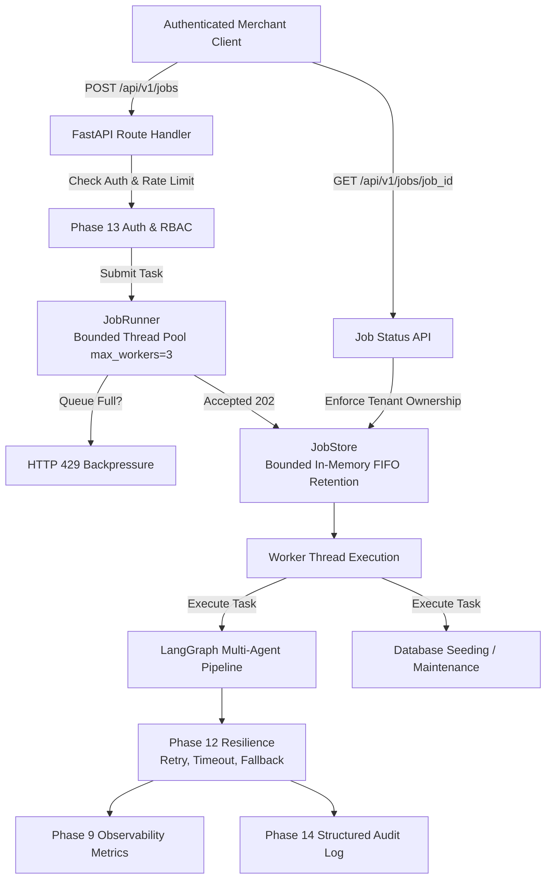

# PayPilot Phase 16: Background Jobs & Asynchronous Task Processing Architecture

---

## 1. Executive Summary & Problem Formulation
In high-throughput merchant analytics, operations vary widely in duration and latency expectations. PayPilot separates **synchronous, interactive user-facing workflows** from **asynchronous, resource-intensive or long-running tasks** without degrading core API performance or breaking backward compatibility.

Phase 16 establishes a clean, bounded **Background Job Processing Framework** (`JobRunner` and `JobStore`) that:
1. Retains synchronous real-time diagnostics on `POST /api/v1/analyze` ($100-300\text{ ms}$).
2. Provides asynchronous execution via `POST /api/v1/jobs` returning `202 Accepted` immediately.
3. Implements strict tenant isolation and RBAC authorization (`GET /api/v1/jobs/{job_id}`).
4. Enforces backpressure via bounded worker pools (`max_workers=3`) and queue limits (`max_queue_size=50`).
5. Reuses Phase 12 resilience (timeouts, retries, circuit breakers, fallback) and Phase 14 structured audit logging.

---

## 2. Workload Audit & Classification

| Operation / Endpoint | Typical Duration | Resource Profile | Classification | Rationale |
| :--- | :--- | :--- | :--- | :--- |
| **`POST /api/v1/analyze`** | $80 - 250\text{ ms}$ | CPU (deterministic) + I/O (LLM) | **A. Must Be Synchronous** | Merchants expect immediate interactive diagnostic answers. |
| **`GET /health`, `/ready`** | $< 2\text{ ms}$ | Memory read + status check | **A. Must Be Synchronous** | Kubernetes / load balancer health probes must never block or wait. |
| **`GET /metrics`** | $< 5\text{ ms}$ | In-memory atomic snapshot | **A. Must Be Synchronous** | Prometheus telemetry scrapers require sub-second synchronous response. |
| **`GET /admin/audit`** | $5 - 15\text{ ms}$ | In-memory filtered slice | **A. Must Be Synchronous** | Administrative compliance inspection on bounded event store. |
| **`POST /api/v1/jobs` (Async Analysis)** | $200 - 800\text{ ms}$ | Multi-agent execution | **C. Background Job** | Batch analytics, automated scheduled audits, or programmatic integrations. |
| **Database Migration (`seed_database_from_csv`)** | $90 - 300\text{ ms}$ | Disk I/O & bulk SQL insert | **C. Background Job** | Heavy transactional batch processing; should not block API worker threads. |
| **Benchmark Suite (`run_evaluation.py`)** | $1 - 10\text{ s}$ | Multi-case simulation runs | **C. Background Job** | Long-running test evaluation suite. |
| **Telemetry Persistence Sync** | $1 - 10\text{ ms}$ | Redis network I/O | **B. Can Be Asynchronous** | Non-blocking telemetry sync handled asynchronously without blocking HTTP response. |

---

## 3. Architecture & Execution Model Decision Matrix



### Comparative Evaluation of Background Processing Approaches

| Execution Approach | Complexity | Durability | Concurrency Control | Dependency Overhead | Decision |
| :--- | :--- | :--- | :--- | :--- | :--- |
| **1. FastAPI `BackgroundTasks`** | Lowest | None (In-process) | Unbounded | Zero | **Rejected**: Fire-and-forget only; cannot query status, inspect results, or throttle concurrency. |
| **2. Bounded `ThreadPoolExecutor` + `JobStore`** | Low | In-memory bounded | Strict (`max_workers=3`, `queue=50`) | Zero | **SELECTED (Current Architecture)**: Clean, fast, zero-dependency, robust, and offline testable. |
| **3. Redis Queue (RQ) / Celery** | Moderate | Optional Redis | Redis queue broker | External Redis + Celery worker daemon | **Documented as Future Horizontal Scaling**: Unjustified operational complexity for single-node container deployment. |
| **4. Kafka / RabbitMQ Streams** | High | Persistent logs | Distributed consumer groups | Multi-node cluster + JVM/Erlang brokers | **Rejected**: Massive architectural bloat for PayPilot's analytical workload. |

---

## 4. Job Schema & Lifecycle State Machine

```
  [SUBMIT] ──> QUEUED (Status: 202 Accepted)
                  │
                  ▼
               RUNNING
               ├──► [Success] ──► COMPLETED (Stores result + duration_ms)
               └──► [Error]   ──► FAILED (Captures error_category + safe message)
```

### Schema Definition (`JobRecord`)
- `job_id`: Unique identifier (`job_...`)
- `task_type`: Operation category (`async_analysis`, `database_migration`, etc.)
- `client_id`: Authenticated tenant principal
- `role`: Principal role (`analyst`, `admin`)
- `request_id`: Correlated tracking ID
- `status`: Lifecycle state (`queued`, `running`, `completed`, `failed`, `cancelled`)
- `created_at`: UTC timestamp (ISO-8601)
- `started_at`: Execution start timestamp
- `completed_at`: Execution completion timestamp
- `duration_ms`: Total execution latency
- `parameters`: Sanitized input dictionary
- `result`: Structured output dictionary
- `error`: Error classification dictionary (`category`, `message`)

---

## 5. Security Model & Tenant Isolation

1. **Authentication & Authorization**:
   - `POST /api/v1/jobs`: Requires `analyst` or `admin` role via `X-API-Key` or `Authorization: Bearer`.
   - `GET /api/v1/jobs/{job_id}`: Requires `analyst` or `admin` role.
2. **Tenant Isolation Guarantee**:
   - An authenticated analyst can **only** inspect or list jobs that match their own `client_id`.
   - Attempts to access another merchant's `job_id` return **`HTTP 403 Forbidden`**.
   - Admin principals can inspect and list all jobs across all tenants.
3. **Secret Redaction**:
   - Job parameters and results are scrubbed via `redact_sensitive_dict` and `summarize_query_safely`. API keys, tokens, and passwords are never persisted in job state.

---

## 6. Resilience, Retry, and Observability Integration

1. **Resilience Reuse**: Background tasks reuse existing Phase 12 circuit breakers, upstream timeouts, and deterministic fallback.
2. **Metrics Emitted**:
   - `jobs.jobs_submitted`: Total jobs queued.
   - `jobs.jobs_completed`: Total jobs successfully finished.
   - `jobs.jobs_failed`: Total jobs that experienced unhandled failures.
   - `jobs.avg_duration_ms`: Average background execution time.
3. **Audit Correlation**:
   - Submitting a job emits `event_type="job_submitted"` (`status_code=202`).
   - Finishing a job emits `event_type="job_completed"` or `event_type="job_failed"`.

---

## 7. Performance & Benchmark Results

### Benchmark Execution (`evaluation/job_benchmark.py`)
- **Job Submission Overhead**:
  - Mean Latency: **0.134 ms** / submission
  - P95 Latency: **0.177 ms**
- **Background Execution Throughput (4 workers, 25 multi-agent jobs)**:
  - Total Duration: **2.80 s**
  - Throughput: **8.93 jobs / sec**
  - Mean Job Execution Latency: **427.48 ms**
  - Completion Rate: **100.0% (25/25 jobs completed)**
- **In-Memory State Polling Latency**:
  - Mean Latency: **0.001 ms** / lookup

---

## 8. Current Implementation vs. Future Enterprise Scaling

| Architectural Layer | Current Implementation (Phase 16) | Future Enterprise Distributed Architecture |
| :--- | :--- | :--- |
| **Worker Execution** | In-process bounded `ThreadPoolExecutor` (`max_workers=3`) | Distributed Celery / Temporal worker cluster on Kubernetes |
| **Job State Storage** | Bounded thread-safe in-memory `InMemoryJobStore` (`max_retained=200`) | Durable PostgreSQL `jobs` table with state index + TTL |
| **Message Broker** | In-memory thread queue (`max_queue_size=50`) | Managed AWS SQS / Redis Streams / RabbitMQ broker |
| **Real-Time Updates** | REST polling (`GET /api/v1/jobs/{job_id}`) | WebSockets / Server-Sent Events (SSE) / Webhook callbacks |
| **Task Deduplication** | In-memory job registry lookup | Distributed Redis lease locks with idempotent idempotency keys |

---

## 9. Verification & Regression Summary

1. **Pytest Suite**: **164/164 passed** (0 failures, 100% pass rate in 23.04s).
2. **Offline Multi-Agent Evaluation**: **32/32 benchmark cases passed** (100% pass rate, 0 live API calls).
3. **Performance Benchmark**: **101 requests executed with 0 failures** across sequential and concurrent loads.
4. **Job Benchmark**: **25/25 background tasks executed with 0 failures**.
