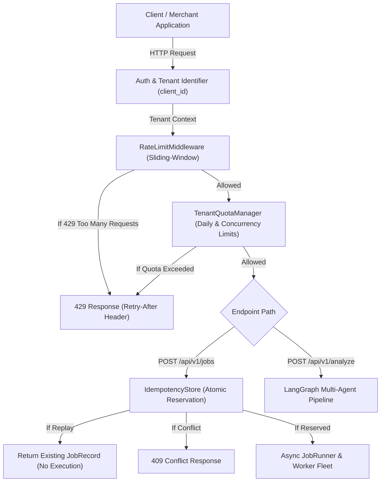

# Phase 21: API Traffic Management, Tenant Quotas & Idempotency Specification

## 1. Overview & Architecture

PayPilot Phase 21 delivers a production-grade API traffic-management and defense layer designed to safeguard backend inference pipelines, worker queues, and persistence stores from volumetric abuse, uncoordinated concurrency, duplicate requests, and retry storms.

---

## 2. Distributed Rate Limiting

### Strategy & Algorithm
- **Sliding-Window Log / ZSET**: Enforces rate limiting per rolling window rather than fixed buckets to prevent boundary burst doubling.
- **Endpoint Granularity**:
  - `POST /api/v1/analyze`: Default 60 requests/minute (`ANALYZE_RATE_LIMIT_PER_MINUTE`).
  - `POST /api/v1/jobs`: Default 30 requests/minute (`JOB_RATE_LIMIT_PER_MINUTE`).
  - General endpoints: Default 60 requests/minute (`RATE_LIMIT_REQUESTS`).
  - Exempt endpoints: `/health`, `/ready`, `/docs`, `/redoc`, `/openapi.json`.
- **Tenant Identification**: Extracted from API key (`X-API-Key`), Bearer token (`Authorization: Bearer`), or reverse-proxy IP (`X-Forwarded-For`).
- **Standardized Response**: HTTP 429 with explicit `Retry-After` header and structured error response.

---

### 3. Multi-Tenant Quotas & Concurrency Bounds

- **Daily Analysis Quota**: Tracks and limits total interactive analyses per tenant (`TENANT_DAILY_ANALYZE_QUOTA`, default 1,000/day).
- **Daily Job Submission Quota**: Tracks and limits total background job submissions per tenant (`TENANT_DAILY_JOB_QUOTA`, default 500/day).
- **Active Concurrent Job Limit**: Restricts simultaneous long-running jobs per tenant (`TENANT_MAX_CONCURRENT_JOBS`, default 5).
  - Monitored at job launch and decremented atomically in `JobRunner` upon job completion or failure.

### Deterministic Quota Semantics (Hardening Pass Specification)

| Scenario | Quota Impact | Rationale & Semantics |
| :--- | :--- | :--- |
| **A. Idempotent Replay** | **NO quota consumed** | A replay returns the existing cached job/result without executing a new operation. |
| **B. Rate-Limited Request** | **NO quota consumed** | The request was blocked at the perimeter middleware before admission. |
| **C. Queue-Full Rejected Job** | **NO quota consumed** | The job was rejected by backpressure and not admitted to the worker queue (quota is rolled back). |
| **D. Successfully Accepted Job** | **YES (1 unit consumed)** | Represents tenant entitlement usage for admitting and scheduling a job into the queue. |
| **E. Asynchronous Job Later Fails** | **Daily submission quota remains consumed; Active concurrency is released** | Admission capacity was consumed, but the execution slot is freed for subsequent jobs. |
| **F. Daily Quota Reset** | **Deterministic midnight rollover** | Reset occurs deterministically on UTC calendar day change via time/day provider. |

---

## 4. Request Idempotency Layer

### Idempotency-Key Contract
- **Target Endpoint**: `POST /api/v1/jobs`.
- **Header**: `Idempotency-Key: <key>`.
- **Key Syntax Validation**: 1 to 128 characters, matching `^[A-Za-z0-9_\-:.]{1,128}$`.
- **Payload Normalization & Hashing**: Computes deterministic SHA-256 hash over normalized JSON payload (`query`, `task_type`, `metadata`).
- **Tenant Isolation**: Keys are strictly scoped to `(tenant_id, idempotency_key)` tuples. Tenant A using key `ABC` has zero collision or access with Tenant B using key `ABC`.

### Lifecycle & Reservation Semantics
1. **`RESERVED`**: First submission with this key. Key is atomically acquired in the `IdempotencyStore`. The job is submitted to `JobRunner`, and the resulting `JobResponse` is cached with status `completed`.
2. **`REPLAY`**: A subsequent submission with the exact same key and matching payload hash. Returns the cached `JobResponse` immediately without creating duplicate jobs or consuming worker execution time. Under concurrent races (e.g. 50 parallel requests), exactly ONE job is created while all others await completion and receive idempotent replays.
3. **`CONFLICT`**: A subsequent submission with the same key but a *different* payload hash. Returns HTTP 409 Conflict.

---

## 5. Storage Abstractions & High Availability

| Store Layer | In-Memory Implementation | Distributed Redis Implementation | Graceful Fallback |
| :--- | :--- | :--- | :--- |
| **Rate Limiting** | `InMemoryRateLimiter` (`collections.deque`) | `RedisRateLimiter` (Atomic ZSET) | Transparent fallback to in-memory on disconnect |
| **Tenant Quotas** | `InMemoryQuotaManager` (Thread-safe dicts) | `RedisQuotaManager` (Atomic `INCR` + TTL) | Transparent fallback to in-memory on error |
| **Idempotency** | `InMemoryIdempotencyStore` (FIFO + TTL) | `RedisIdempotencyStore` (`SET NX EX`) | Transparent fallback to in-memory on error |

---

## 6. Observability & Telemetry

### Traffic Metric Counters (`backend/observability/metrics.py`)
- `rate_limit_rejections`: Total volumetric rate limit rejections.
- `quota_rejections`: Total tenant daily quota exhaustion rejections.
- `concurrency_rejections`: Total concurrent active job limit rejections.
- `queue_full_rejections`: Total worker queue backpressure drops (503/429).
- `idempotency_replays`: Total duplicate requests successfully replayed from cache.
- `idempotency_conflicts`: Total payload mismatch conflicts detected (409).
- `overload_rejections`: Total load shedding rejections.

### Security & Sanitization
- Audit events never log raw `Idempotency-Key` headers, API keys, or bearer tokens; safe SHA-256 fingerprints (`idem_<hash[:12]>`) are recorded instead.

---

## 7. Performance Benchmarks & Demarcation

> [!NOTE]
> **LOCAL BENCHMARK / SIMULATION DISCLAIMER**: The microbenchmarks below were measured under local test execution and process-local memory stores. Distributed cloud deployments with external network hops will incur additional roundtrip latencies.

| Section / Workload | Mean Latency | Median (P50) | P95 Latency | P99 Latency | Status & Scope |
| :--- | :--- | :--- | :--- | :--- | :--- |
| **A. Normal Traffic Check (Allowed)** | `0.0006 ms` | `0.0006 ms` | `0.0008 ms` | `0.0013 ms` | TESTED LOCALLY |
| **B. Rate Limit Rejection (Fast Path)** | `0.0011 ms` | `0.0010 ms` | `0.0012 ms` | `0.0015 ms` | TESTED LOCALLY |
| **C. Concurrent Idempotency Race (50 threads)** | `0.0034 ms` | `0.0024 ms` | `0.0070 ms` | `0.0164 ms` | TESTED LOCALLY (`1 created, 0 dupes`) |
| **D. Cross-Tenant Isolated Reservation** | `0.0050 ms` | `0.0046 ms` | `0.0055 ms` | `0.0099 ms` | TESTED LOCALLY |
| **E. Quota Check & Exhaustion Rejection** | `0.0029 ms` | `0.0029 ms` | `0.0031 ms` | `0.0035 ms` | TESTED LOCALLY |
| **F. Queue Saturation / Active Job Check** | `0.0007 ms` | `0.0007 ms` | `0.0007 ms` | `0.0008 ms` | TESTED LOCALLY |
| **G. Redis Store Fallback Simulation** | `0.0016 ms` | `0.0010 ms` | `0.0029 ms` | `0.0131 ms` | TESTED LOCALLY |
