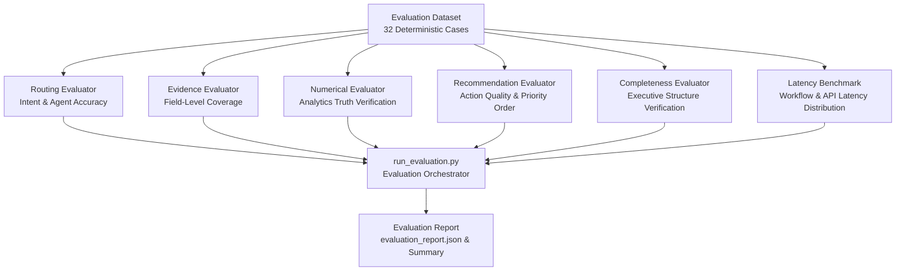

# PayPilot Phase 7: Evaluation, Benchmarking & AI Quality

---

## 1. Overview & Evaluation Architecture

Phase 7 establishes a multi-agent evaluation and benchmarking framework for PayPilot. Designed for AI Engineers and production operations, it provides deterministic, repeatable evaluation across eight dimensions:



---

## 2. Dataset Design (`evaluation/dataset.json`)

The evaluation dataset contains **32 ground-truth test cases** spanning six merchant operations categories:

| Category | Query Count | Focus Areas |
| :--- | :---: | :--- |
| **Revenue** | 5 | Revenue decline root causes, realized revenue, gross loss, leakage audits, recoverable opportunity. |
| **Payment** | 6 | Payment method failure rates (Netbanking friction), failure reasons (User Aborted, Bank Server Timeout), UPI errors, gateway downtime. |
| **Checkout** | 5 | Mobile vs. desktop conversion rates (80.66% vs 85.11%), iOS conversion, tablet performance, Android cart drop-off losses. |
| **Customer** | 5 | Product categories, Fashion refund anomaly (17.99% vs 8.24% average), category net revenue, refund amounts. |
| **What-If** | 5 | Scenario simulations for +1%, +2%, +3%, +4%, and +5% payment success rate uplifts with exact transaction and revenue gains. |
| **Holistic** | 6 | Multi-agent audits, management prioritization, executive decision-making, full funnel diagnostic sweeps. |

### Schema Specification
```json
{
  "id": "REV-01",
  "category": "revenue",
  "query": "Why did my revenue decrease and where is my biggest leakage?",
  "expected_intent": "revenue",
  "expected_agents": ["revenue_agent", "payment_agent", "checkout_agent", "customer_agent"],
  "required_evidence": ["revenue", "payment", "checkout", "customer"],
  "expected_metrics": {
    "total_realized_revenue_inr": 50092576.66,
    "recoverable_opportunity_inr": 3488251.64,
    "payment_success_rate_pct": 81.71
  },
  "min_actions_expected": 3,
  "expected_action_category": "checkout_optimization"
}
```

---

## 3. Metrics & Mathematical Formulas

### 1. Routing Accuracy
$$\text{Routing Accuracy} = \frac{\sum \mathbb{I}(\text{actual\_intent} = \text{expected\_intent})}{N} \times 100$$

### 2. Agent Recall & Precision
$$\text{Agent Recall} = \frac{\text{True Positives}}{\text{True Positives} + \text{False Negatives}} \times 100$$
$$\text{Agent Precision} = \frac{\text{True Positives}}{\text{True Positives} + \text{False Positives}} \times 100$$
$$\text{Unnecessary Agent Rate} = \frac{\text{False Positives}}{\text{True Positives} + \text{False Positives}} \times 100$$

### 3. Evidence Coverage
$$\text{Evidence Coverage} = \frac{\text{Present Required Sections}}{\text{Total Required Sections}} \times 100$$

### 4. Numerical Consistency
Verifies that numbers produced in pipeline states and evidence match deterministic ground truth from `backend/tools/analytics.py` within documented tolerance:
$$\text{Within Tolerance} = (|v_{\text{act}} - v_{\text{exp}}| \le \delta_{\text{abs}}) \lor \left( \frac{|v_{\text{act}} - v_{\text{exp}}|}{v_{\text{exp}}} \le \delta_{\text{rel}} \right)$$
- **Default Relative Tolerance ($\delta_{\text{rel}}$)**: `1.0%` (0.01)
- **Default Absolute Tolerance ($\delta_{\text{abs}}$)**: `0.5` units (for percentages/counts)

### 5. Recommendation Correctness
Evaluates whether generated recovery actions satisfy:
1. **Count Sufficiency**: $\text{count}(\text{actions}) \ge \text{min\_actions\_expected}$
2. **Monotonic Priority Ordering**: $\text{score}(P_i) \ge \text{score}(P_{i+1}) \quad \forall i$
3. **Field Validity**: Impact $> 0$, Confidence $\in [0, 1]$, Urgency $\in \{\text{High}, \text{Medium}, \text{Low}\}$, Effort $\in \{\text{Low}, \text{Medium}, \text{High}\}$, Priority Score $\in [0, 100]$.
4. **Executive Alignment**: Executive summary references actual top-ranked action ($P_1$).

### 6. Response Completeness
Checks presence of all five structural executive briefing sections:
- **Diagnosis**: Overall health / realized revenue context
- **Evidence**: Detected leakages / failure metrics
- **Actions**: Prioritized recovery actions ($P_1$, $P_2$)
- **Recommendation**: Explicit executive guidance for management
- **Upside**: Recoverable monetary opportunity / What-If uplift

---

## 4. Latency Benchmarking (`evaluation/benchmark.py`)

Benchmarks latency distribution across 12 representative queries:

$$\text{P95 Latency} = \text{Value at Index } \lfloor 0.95 \times N \rfloor \text{ of Sorted Latencies}$$

### Production Benchmark Results
| Component / Probe | Min (ms) | Avg (ms) | Median (ms) | P95 (ms) | Max (ms) |
| :--- | :---: | :---: | :---: | :---: | :---: |
| **Workflow Pipeline** | 226.28 | 819.85 | 783.90 | 1373.87 | 1373.87 |
| **HTTP API (`POST /api/v1/analyze`)** | 245.13 | 824.25 | 794.36 | 1346.67 | 1346.67 |
| **Liveness Probe (`GET /health`)** | 0.42 | 4.26 | 0.55 | 7.67 | 7.67 |
| **Readiness Probe (`GET /ready`)** | 59.85 | 71.17 | 62.76 | 94.51 | 94.51 |

---

## 5. Failure Analysis Taxonomy

Failures detected during evaluation are automatically classified into five categories:
1. **`routing_failure`**: Supervisor assigned incorrect intent or omitted required specialist agents.
2. **`missing_evidence`**: Specialist agent failed to populate required evidence sections.
3. **`numerical_mismatch`**: Metric deviated beyond documented numerical tolerance.
4. **`recommendation_mismatch`**: Action ranking violated monotonic priority, missing required fields, or omitted top action in executive summary.
5. **`api_workflow_failure`**: Uncaught exception or timeout during pipeline execution.

---

## 6. Offline Mock Evaluation Architecture

To ensure benchmarks are 100% deterministic, reproducible, fast, and completely decoupled from external API network latency or rate limits, the evaluation suite utilizes an offline Mock LLM (`evaluation/mock_llm.py`):

- **Zero Network Egress**: Traps and intercepts LLM calls during benchmark execution, preventing external network calls to `integrate.api.nvidia.com`.
- **Production Isolation**: Production PayPilot (`POST /api/v1/analyze`) remains 100% connected to live NVIDIA (`meta/llama-3.3-70b-instruct`).
- **Automated Verification**: `tests/test_evaluation.py::test_evaluation_never_invokes_real_nvidia_provider` asserts that initializing real `ChatNVIDIA` during evaluation triggers a critical test failure.

---

## 7. How to Run Evaluation & Benchmarks

### 1. Full Evaluation Suite (100% Offline & Deterministic)
```bash
python evaluation/run_evaluation.py
```

### 2. Performance & Latency Benchmark
```bash
python evaluation/benchmark.py
```

### 3. Automated Test Suite (Pytest)
```bash
pytest -v
```
*(Runs all 69 tests across unit analytics, API routes, hardening, recovery agent, and offline evaluation modules).*

