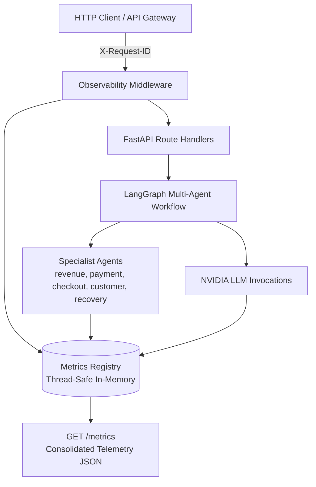

# PayPilot Phase 9: Production Observability & Monitoring

---

## 1. Overview & Architecture

Phase 9 establishes an in-memory, thread-safe, lightweight observability layer for PayPilot. It provides real-time visibility into HTTP traffic, specialist multi-agent execution cycles, NVIDIA LLM provider latency and fallback occurrences, and standardized error categories—with zero external paid dependencies and zero secret leakage.



---

## 2. Core Telemetry Subsystems

### A. Request Lifecycle Metrics
- **`total`**: Total HTTP requests received across all routes.
- **`successful`**: Count of requests responding with `2xx` or `3xx` HTTP status codes.
- **`failed`**: Count of requests responding with `4xx` or `5xx` HTTP status codes.
- **`total_duration_ms` / `average_duration_ms`**: Cumulative and running average request processing latency in milliseconds.
- **`by_endpoint`**: Request volume breakdown per API route (`/health`, `/ready`, `/metrics`, `/api/v1/analyze`).
- **`by_status`**: Request counts indexed by HTTP status code (`200`, `400`, `422`, `500`, `503`).
- **`by_intent`**: Analysis requests classified by detected merchant intent (`revenue`, `payment`, `checkout`, `customer`, `what_if`).

### B. Specialist Agent Performance Metrics
For each specialist node (`revenue_agent`, `payment_agent`, `checkout_agent`, `customer_agent`, `recovery_agent`):
- **`executions`**: Total execution cycles triggered by supervisor routing.
- **`failures`**: Unhandled exceptions encountered inside the node.
- **`total_duration_ms`**: Cumulative execution time across deterministic analytical tool invocations.
- **`average_duration_ms`**: Running average computation latency per agent.

### C. LLM Provider & Reliability Metrics
- **`provider` / `configured_provider`**: Active backend (`nvidia` or `deterministic_fallback`).
- **`model`**: Target model (`meta/llama-3.3-70b-instruct`).
- **`is_live_llm`**: Boolean indicator of whether active requests call the live NVIDIA endpoint.
- **`total_calls`**: Invocations attempted by supervisor, aggregator, and recovery agent.
- **`successful_calls`**: Invocations returning valid structured LLM responses.
- **`failed_calls`**: Invocations resulting in timeouts or network errors.
- **`timeouts`**: Specific timeout events triggered when upstream exceeds `LLM_REQUEST_TIMEOUT`.
- **`fallbacks`**: Seamless fallbacks to deterministic heuristics and synthesized executive briefings.
- **`average_latency_ms`**: Running average upstream round-trip latency.

### D. Error Categorization & Taxonomy
Errors are safely grouped into standard non-leaking categories:
- **`validation_error`**: Empty queries, oversized text (>1000 chars), or malformed JSON payloads.
- **`timeout`**: Upstream LLM read timeouts or gateway latency triggers.
- **`provider_error`**: Connection pool resets or HTTP 503 service unavailable states.
- **`routing_error`**: Unparseable LLM routing output.
- **`analytics_error`**: Failures within deterministic pandas calculation pipelines.
- **`internal_error`**: Catch-all server exceptions without leaking stack traces.

---

## 3. Endpoints Reference

### `GET /metrics`
Returns real-time consolidated telemetry.

#### Example Response
```json
{
  "requests": {
    "total": 4,
    "successful": 4,
    "failed": 0,
    "total_duration_ms": 77337.8,
    "average_duration_ms": 19334.45,
    "by_endpoint": {
      "/metrics": 1,
      "/health": 1,
      "/ready": 1,
      "/api/v1/analyze": 1
    },
    "by_status": {
      "200": 4
    },
    "by_intent": {
      "payment": 1
    }
  },
  "agents": {
    "revenue_agent": {
      "executions": 0,
      "failures": 0,
      "total_duration_ms": 0.0,
      "average_duration_ms": 0.0
    },
    "payment_agent": {
      "executions": 1,
      "failures": 0,
      "total_duration_ms": 532.63,
      "average_duration_ms": 532.63
    },
    "checkout_agent": {
      "executions": 0,
      "failures": 0,
      "total_duration_ms": 0.0,
      "average_duration_ms": 0.0
    },
    "customer_agent": {
      "executions": 0,
      "failures": 0,
      "total_duration_ms": 0.0,
      "average_duration_ms": 0.0
    },
    "recovery_agent": {
      "executions": 1,
      "failures": 0,
      "total_duration_ms": 115.8,
      "average_duration_ms": 115.8
    }
  },
  "llm": {
    "provider": "nvidia",
    "configured_provider": "nvidia",
    "model": "meta/llama-3.3-70b-instruct",
    "is_live_llm": true,
    "total_calls": 3,
    "successful_calls": 0,
    "failed_calls": 3,
    "timeouts": 3,
    "fallbacks": 3,
    "total_latency_ms": 75000.0,
    "average_latency_ms": 25000.0
  },
  "errors": {
    "total": 3,
    "by_category": {
      "validation_error": 0,
      "timeout": 3,
      "provider_error": 0,
      "routing_error": 0,
      "analytics_error": 0,
      "internal_error": 0
    }
  },
  "uptime_seconds": 124.5,
  "timestamp": "2026-08-22T17:59:13.136000+00:00"
}
```

---

## 4. Request Correlation & Distributed Tracing

Every incoming request is assigned or preserves an `X-Request-ID` header:
1. **Header Propagation**: Client provides `X-Request-ID` (or middleware generates UUID4).
2. **Context Binding**: Bound to `request.state.request_id` and logged in all log events.
3. **Response Headers**:
   - `X-Request-ID`: Correlation identifier.
   - `X-Response-Time-Ms`: End-to-end processing duration in milliseconds.

---

## 5. Security & Privacy Guarantees

- **No Secrets Stored**: `MetricsRegistry` stores counters and numeric timings only.
- **No Prompt Leakage**: Queries and prompt contents are never captured in metrics.
- **Safe Test Isolation**: `reset_metrics()` provides clean programmatic resets for tests without exposing an unauthenticated production reset endpoint.
- **No Stack Traces**: Handlers translate internal failures into standard `ErrorResponse` objects with categorized error telemetry.

---

## 6. Testing Strategy

Automated test coverage in [`tests/test_observability.py`](file:///e:/paypilot/tests/test_observability.py):
1. Telemetry schema validation on `/metrics`.
2. Endpoint and status code counter accounting.
3. Running average calculation checks for agents and requests.
4. LLM timeout and fallback metrics recording.
5. Error categorization across validation, timeout, and provider failures.
6. Request ID correlation verification.
7. Secret non-exposure verification.
8. State isolation verification via `reset_metrics()`.
